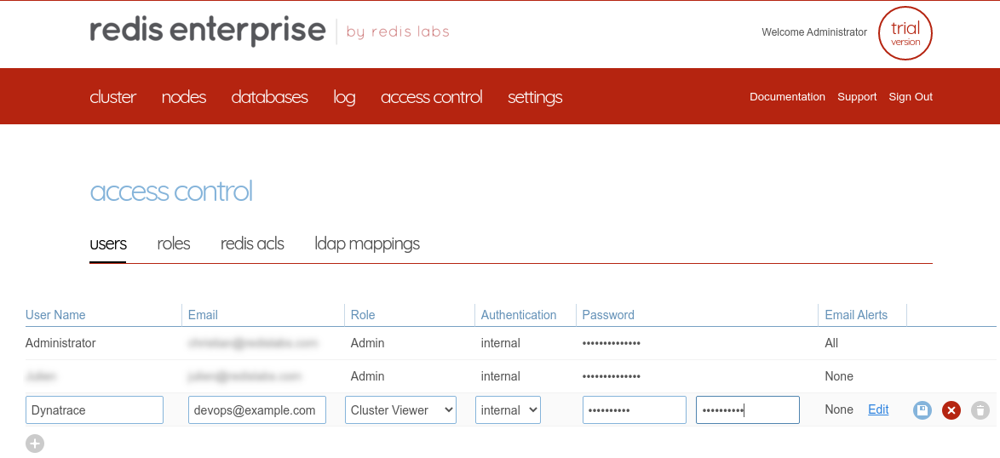
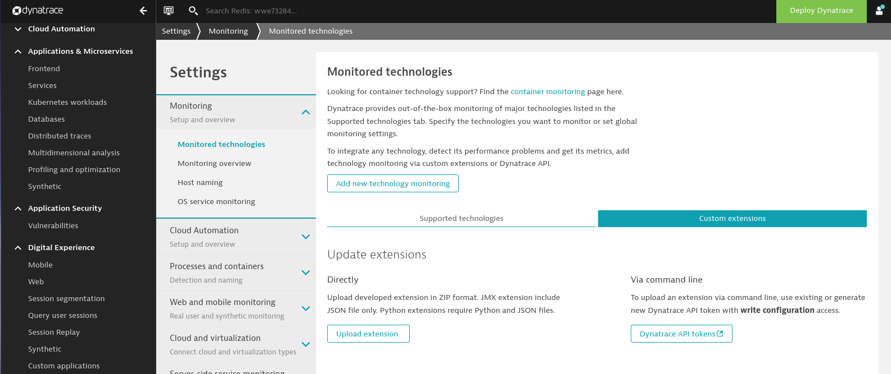
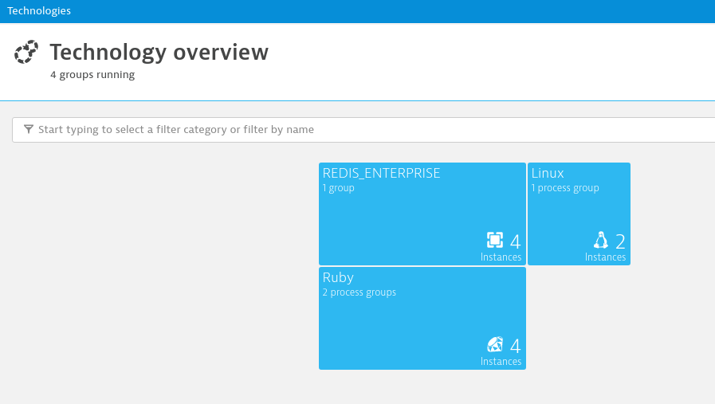
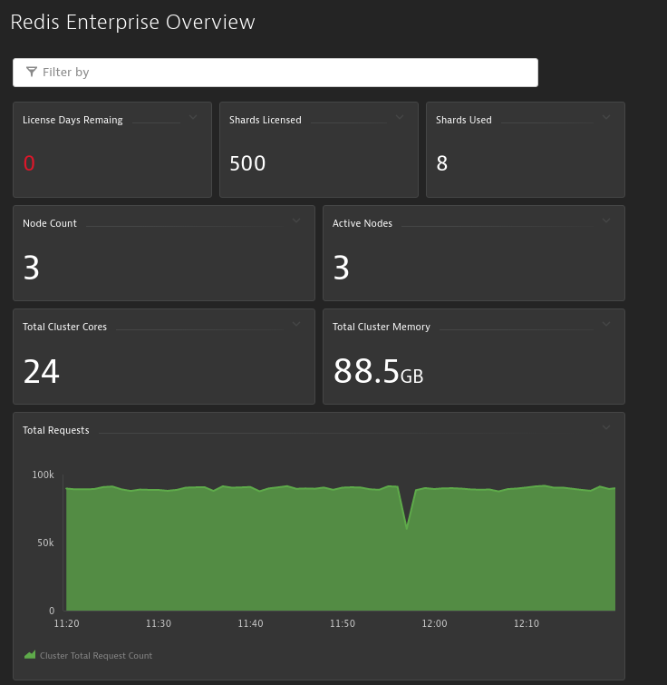
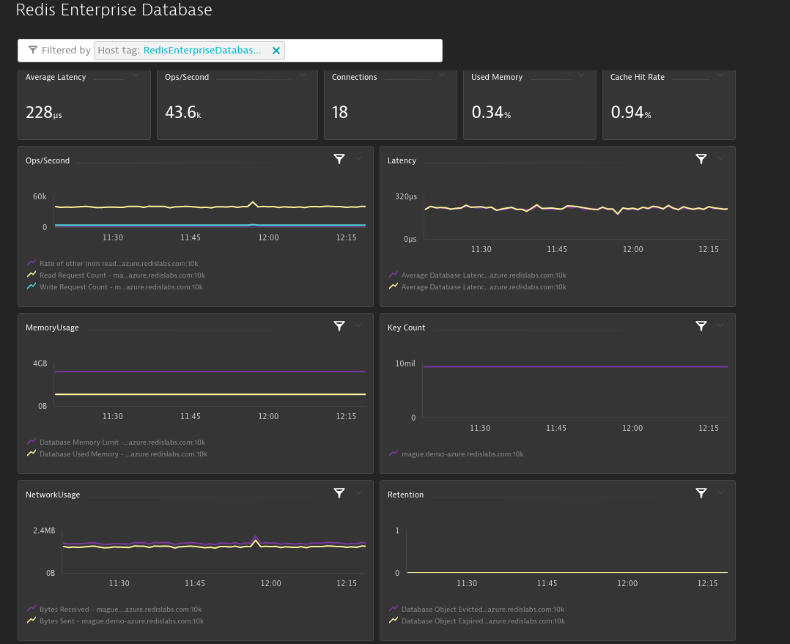
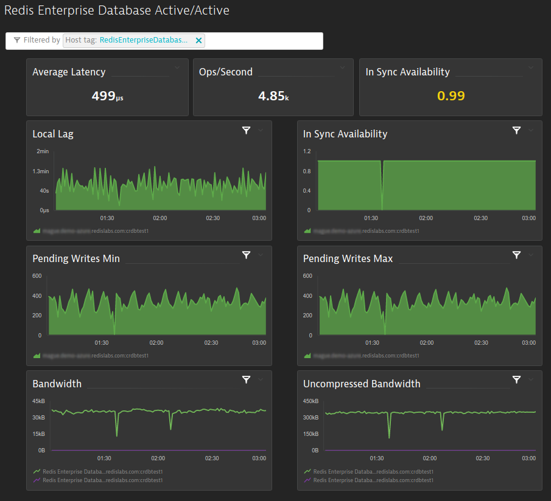
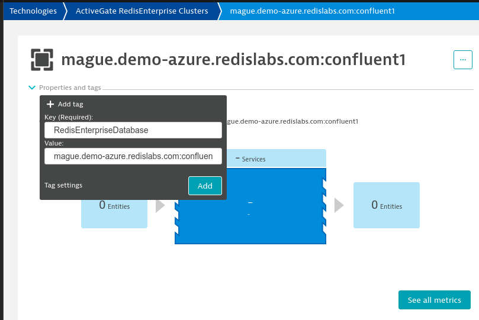

## Redis Enterprise ActiveGate Extension

### Prerequisites

1. Working [Dynatrace Install](https://www.dynatrace.com/support/help/setup-and-configuration/)
2. Working [ActiveGate Instance](https://www.dynatrace.com/support/help/setup-and-configuration/dynatrace-activegate/)
3. Login to a Redis Enterprise Cluster


### Architecture


### Setup Account

#### Setup a read only user Account

Login to your Redis Entprise Instance and click on Access Control


#### Add a new user account with Cluster View Permissions




### SSH into your ActiveGate node

#### Install the Zip file

```
cd /tmp/ 
wget https://redislabs-field-engineering.s3.us-west-1.amazonaws.com/private-preview/active_gate_redisenterprise_plugin/custom.remote.python.redisenterprise.zip
sudo mv /tmp/custom.remote.python.redisenterprise.zip /opt/dynatrace/remotepluginmodule/plugin_deployment/custom.remote.python.redisenterprise.zip
```

#### Restart the service

```
sudo service dynatracegateway restart
```

### Install and setup custom extension

#### On Dynatrace go into Settings/Monitoring/Monitored Technologies/Custom Extensions Tab



#### Click on Upload Extensions


#### Upload Extension and click on the extension to configure the endpoint


#### Check to ensure the Status is OK


#### Under Infrastructuer Click on Technology and Proceses



#### Select REDIS_ENTERPRISE


#### Select Active Gate RedisEnterprise Clusters


The cluster level information is the FQDN of the cluster and the database level information is on the FQDN:DB_NAME devices

#### Events


#### Cluster Stats


#### DB Stats


### Enhanced Dashboards

There are three example dashboards for<br>

- [Cluster Statistics](dashboards/Redis_Enterprise_Overview.json)
- [Database Statistics](dashboards/Redis_Enterprise_Database.json)
- [Active Active Statistics](dashboards/Redis_Enterprise_Database_Active_Active.json)


#### Screenshots







To enable filtering on the database dashboard above, you will need to manually tag the device as the current API does not allow us to do this automatically.

Go to Technologies -> ActiveGate RedisEnterprise Clusters -> CLUSTER and add the RedisEnterpriseDatabase tag 




To install the dashboards save the JSON files above and select Import dashboards from the dashboards page.


### Monitoring Guide

Included is a example [monitoring guide for Redis Enterprise](docs/RedisEnterpriseSoftwareMonitoringGuide.pdf).  It includes suggestions for KPIs to monitor and offers a sample runbook. 


### Troubleshooting Guide

[Plugin Troubleshooting Guide](docs/TroubleShootingGuide.md) provides tips and tricks to troubleshoot your installation.